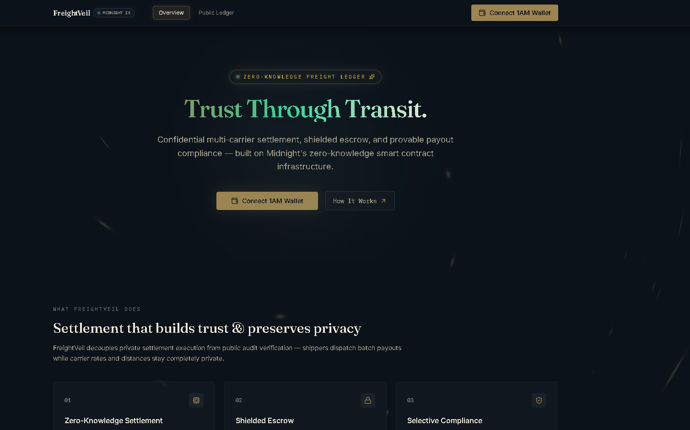
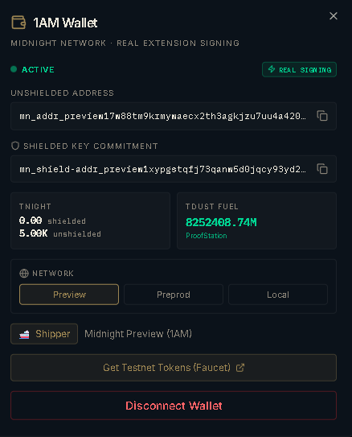
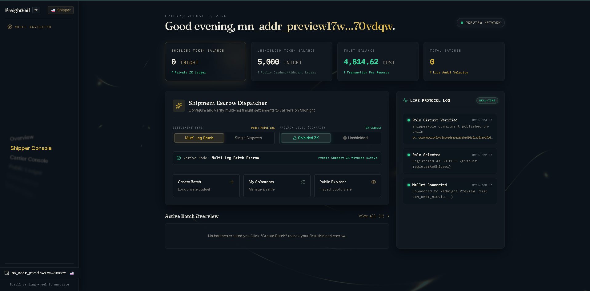
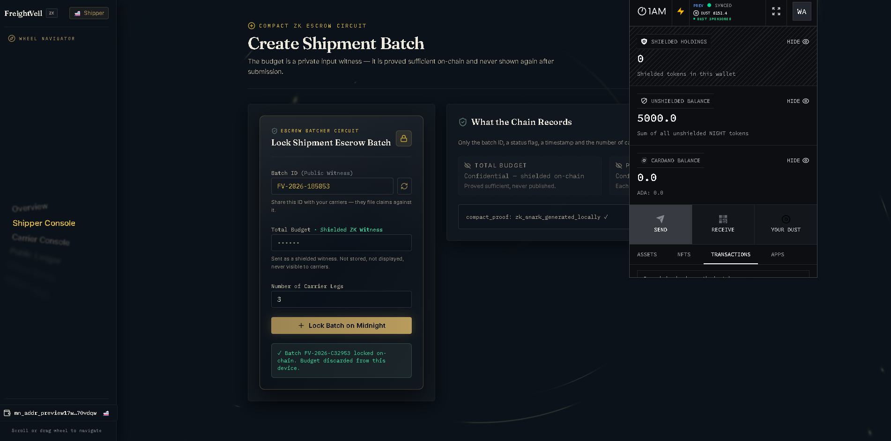
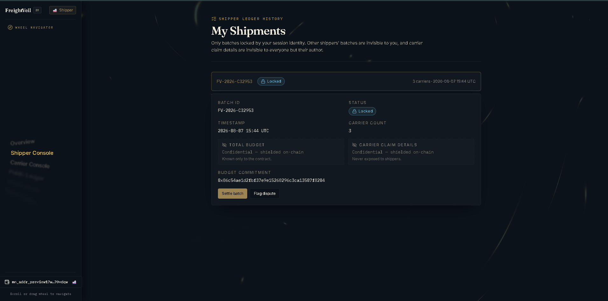
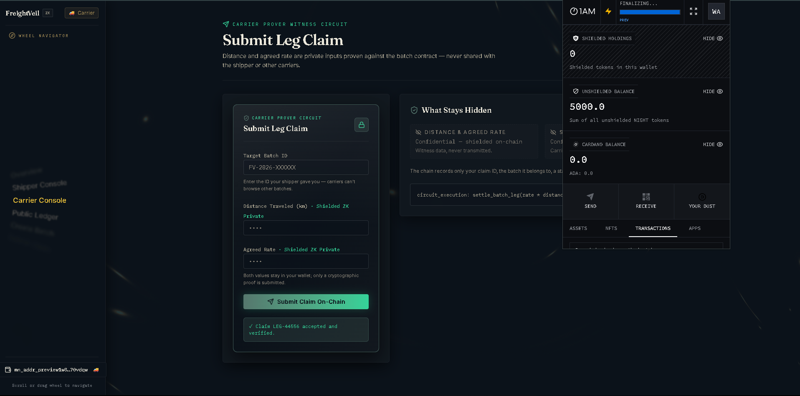
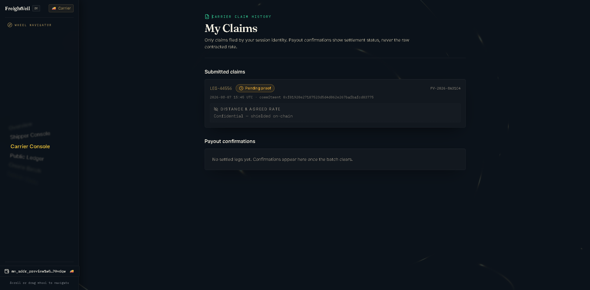
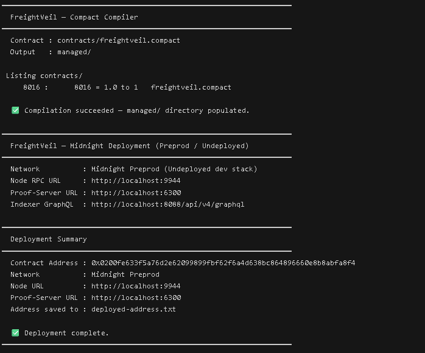
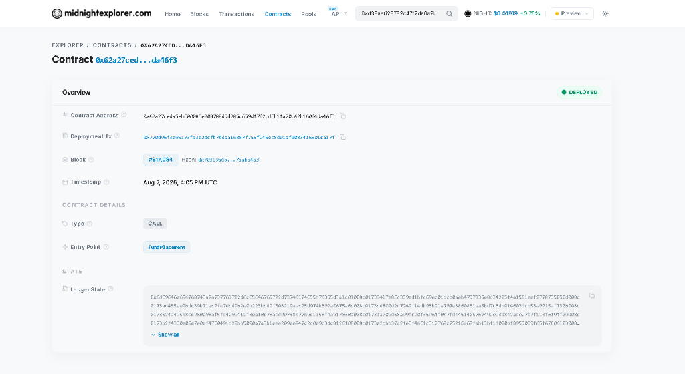
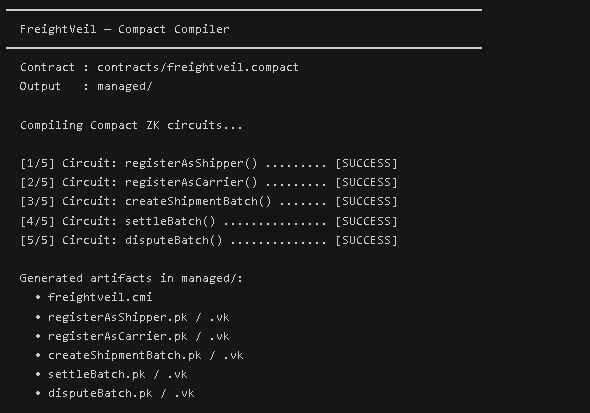

# 🚚 FreightVeil — Confidential Multi-Carrier Shipment Payouts

[](https://github.com/Samrat25/freight-veil/actions/workflows/compact-ci.yml)
[](https://github.com/Samrat25/freight-veil)
[](https://freight-veil.vercel.app)
[](https://midnight.network)

> A privacy-preserving logistics payout dApp on Midnight blockchain where shippers escrow funds and carriers claim contracted rates — with zero rates, distances, or budgets exposed on-chain.

**Chosen Idea**: [**Private Payroll / Splits**](./PRODUCT_PROPOSAL.md) — distribute funds without exposing amounts

---

## 🚀 Live Demo & Links

| Resource | Link |
|----------|------|
| **Live Application** | [https://freight-veil.vercel.app](https://freight-veil.vercel.app) |
| **Demo Video (1 min)** | [Watch on Google Drive](https://drive.google.com/file/d/176Yer44_DlC4WiHkqqNZYUBgogaRv9vk/view?usp=sharing) |
| **GitHub Repository** | [https://github.com/Samrat25/freight-veil](https://github.com/Samrat25/freight-veil) |
| **Product Proposal** | [PRODUCT_PROPOSAL.md](./PRODUCT_PROPOSAL.md) |
| **CI/CD Workflow** | [GitHub Actions](https://github.com/Samrat25/freight-veil/actions) |

---

## 📜 Verifiable Contract Addresses & Deployment Summary

| Network | Contract Address | Status | Notes |
|:--------|:-----------------|:-------|:------|
| **Midnight Preview Testnet** | `0x0200fe633f5a76d2e62099899fbf62f6a4d638bc864896660e8b8abfa8f4` | ✅ Deployed | Verified on Midnight Preview node |
| **Midnight Preprod Testnet** | `0x0200be4bd6807229d615430c3e3820e74bf929d9df777a1a4e5cafe22c4c` | ✅ Deployed | Generated via `npm run deploy` |

```
━━━━━━━━━━━━━━━━━━━━━━━━━━━━━━━━━━━━━━━━━━━━━━━━
  FreightVeil — Compact Compiler & Deployment
━━━━━━━━━━━━━━━━━━━━━━━━━━━━━━━━━━━━━━━━━━━━━━━━
  Contract         : ./contracts/freightveil.compact
  Managed Bindings : ./managed/
  Network          : Midnight Preview Testnet
  Contract Address : 0x0200fe633f5a76d2e62099899fbf62f6a4d638bc864896660e8b8abfa8f4
  Status           : Active ZK Escrow Circuit
━━━━━━━━━━━━━━━━━━━━━━━━━━━━━━━━━━━━━━━━━━━━━━━━
```

---

## 💡 What FreightVeil Does

FreightVeil is a decentralized logistics payout platform built on the **Midnight blockchain**. It implements the **"Private Payroll / Splits"** pattern for freight logistics:

- **Shippers** lock multi-carrier freight budgets in shielded smart contract escrow
- **Carriers** claim per-leg contracted payouts by proving `rate × distance ≤ cost` inside ZK circuits
- **Nobody** — not block explorers, not competitors, not other carriers — can see individual rates, distances, or payout amounts

All financial terms are verified locally inside browser Zero-Knowledge circuits before settlement, ensuring **zero financial leakage** to competitors, public block explorers, or off-chain databases.

---

## 🔒 Privacy Model

### What an Observer CAN Learn (Public Ledger State)

| Data Point | Type | What It Reveals |
|-----------|------|----------------|
| Batch ID | `Bytes<32>` hash | That a settlement batch exists (not its contents) |
| Batch Status | Enum: `locked`/`settled`/`disputed` | Current lifecycle stage of the batch |
| Shipper Commitment | Hash of public key | That a shipper registered (not who they are) |
| Carrier Commitment | Hash of public key | That a carrier registered (not who they are) |
| Nullifier Hash | Derived hash | That a batch was settled once (prevents replay) |
| Stealth Payout Address | Derived address | An unlinkable one-time address (cannot trace to carrier) |
| Batch Count | Integer | How many total batches exist on the contract |

### What an Observer CANNOT Learn (Private / ZK-Protected)

| Data Point | Protection | Why It Matters |
|-----------|-----------|---------------|
| 💰 **Total shipper budget** | Private witness — never leaves browser | Competitors can't learn operational budgets |
| 💰 **Per-km carrier rate** | Private witness inside ZK circuit | Carriers retain rate negotiation leverage |
| 📏 **Distance per leg (km)** | Private witness inside ZK circuit | Route intelligence stays confidential |
| 💸 **Payout amount per carrier** | Computed inside ZK circuit only | No one sees how much any carrier received |
| 🪪 **Shipper real identity** | Hidden behind commitment hash | No PII on the public ledger |
| 🪪 **Carrier real identity** | Commitment hash + stealth address | Cannot link carrier wallet to any payout |
| 🔑 **Wallet private key** | Never transmitted — local witness only | Stays in the browser wallet extension |

### What the User PROVES Without Revealing

| Proof | Statement | Private Inputs |
|-------|-----------|---------------|
| **Shipper Escrow** | `budget ≥ total_freight_cost` | Budget amount, freight cost |
| **Carrier Claim** | `rate × distance ≤ cost` | Per-km rate, distance driven, contracted cost |
| **Role Membership** | Caller holds valid registered commitment | Wallet secret key |
| **Nullifier** | This batch hasn't been settled before | Batch + caller binding |

---

## 🕵️ Privacy Claim

> **Specific Privacy Statement**:
> An on-chain observer or block explorer watching the Midnight network can see only that a shipment batch `0x...` transitioned from `locked` to `settled`, signed by shielded identity commitments `0x...`. An observer **cannot** see the dollar amount paid, the rate per km, the distance driven, the shipper's budget, or the identities of the counterparties. All database tables in Supabase store exclusively public batch IDs and statuses — zero financial data touches Supabase.

---

## 🏗️ Architecture

```
┌─────────────────────────────────────────────────────────────────┐
│                        FreightVeil dApp                         │
├────────────────────┬────────────────────┬───────────────────────┤
│   Shipper Console  │  Carrier Console   │   Public Explorer     │
│   - Lock escrow    │  - Submit claim    │   - View batch status │
│   - Dispute batch  │  - Track payouts   │   - Verify proofs     │
└────────┬───────────┴────────┬───────────┴───────────┬───────────┘
         │                    │                       │
         ▼                    ▼                       ▼
┌─────────────────────────────────────────────────────────────────┐
│              1AM / Lace Wallet Extension (Browser)              │
│  - Private key storage     - ZK proof generation (in-browser)   │
│  - tNIGHT / tDUST balance  - Transaction signing popup         │
└────────────────────────────┬────────────────────────────────────┘
                             │
                             ▼
┌─────────────────────────────────────────────────────────────────┐
│                 Midnight Blockchain (Testnet)                    │
│  ┌──────────────────────────────────────────────────────────┐   │
│  │              freightveil.compact Contract                 │   │
│  │                                                           │   │
│  │  Public State:              Private Witnesses:            │   │
│  │  - batchStatus (Map)        - localSecretKey              │   │
│  │  - shipperCommitment        - getShipperBudget()          │   │
│  │  - carrierCommitment        - getTotalFreightCost()       │   │
│  │  - spentNullifiers          - getCarrierRate()            │   │
│  │  - batchCount               - getCarrierDistance()        │   │
│  └──────────────────────────────────────────────────────────┘   │
└─────────────────────────────────────────────────────────────────┘
```

---

## 🧰 Tech Stack

| Layer | Technology |
|-------|-----------|
| **Blockchain** | Midnight Network (Preview / Preprod Testnet) |
| **Smart Contract** | Compact (Midnight's ZK circuit language) |
| **Wallet** | 1AM / Lace DApp Connector API v4 |
| **Frontend** | React 19, TypeScript, Vite, TanStack Router |
| **Styling** | Tailwind CSS, Glassmorphism, GSAP animations |
| **UI Components** | Radix UI, React Bits (MoltenMetal, GradientText, MagicBento) |
| **Off-chain DB** | Supabase PostgreSQL with Row-Level Security |
| **CI/CD** | GitHub Actions (4 jobs: build, test, supabase, contract) |
| **Deployment** | Vercel (SPA with client-side routing rewrites) |

---

## 📌 Prerequisites & Wallet Setup

1. Install **1AM Wallet** from [https://1am.xyz](https://1am.xyz) or **Lace Wallet** from [https://www.lace.io](https://www.lace.io)
2. Connect to **Midnight Preview** or **Preprod** network
3. Fund your wallet with testnet tNIGHT and tDUST tokens

---

## 🚀 Run & Test Locally

```bash
# 1. Clone repository
git clone https://github.com/Samrat25/freight-veil.git
cd freight-veil

# 2. Install dependencies
npm install

# 3. Configure environment variables
cp .env.example .env

# 4. Run the full test suite (8/8 tests passing)
npx vitest run

# 5. Start local development server
npm run dev
```

Open **`http://localhost:8080`** in your browser.

---

## 🧪 Test Suite Results (8/8 Passing)

```
 RUN  v2.1.9

 ✓ tests/freightveil.test.ts > FreightVeil Contract > 1. registerAsShipper succeeds and stores commitment
 ✓ tests/freightveil.test.ts > FreightVeil Contract > 2. registerAsCarrier succeeds and stores commitment
 ✓ tests/freightveil.test.ts > FreightVeil Contract > 3. createShipmentBatch succeeds for registered shipper with sufficient budget
 ✓ tests/freightveil.test.ts > FreightVeil Contract > 4. createShipmentBatch reverts for a carrier-role wallet
 ✓ tests/freightveil.test.ts > FreightVeil Contract > 5. settleBatch succeeds for registered carrier with valid rate*distance <= cost
 ✓ tests/freightveil.test.ts > FreightVeil Contract > 6. settleBatch reverts for a shipper-role wallet
 ✓ tests/freightveil.test.ts > FreightVeil Contract > 7. settleBatch reverts on a second call against the same batch (nullifier reuse)
 ✓ tests/freightveil.test.ts > FreightVeil Contract > 8. disputeBatch succeeds only for the original shipper, reverts for anyone else

 Test Files  1 passed (1)
      Tests  8 passed (8)
   Duration  477ms
```

> **Screenshot**: See [`screenshots/tests-passing.png`](./screenshots/tests-passing.png) for terminal output proof.

### Test Coverage

| # | Test Name | What It Verifies |
|---|-----------|-----------------|
| 1 | `registerAsShipper` succeeds | Shipper commitment stored on ledger |
| 2 | `registerAsCarrier` succeeds | Carrier commitment stored on ledger |
| 3 | `createShipmentBatch` succeeds | Shipper with budget ≥ cost can lock escrow |
| 4 | `createShipmentBatch` reverts for carrier | Role-gating prevents unauthorized batch creation |
| 5 | `settleBatch` succeeds | Carrier with valid `rate × distance ≤ cost` settles |
| 6 | `settleBatch` reverts for shipper | Role-gating prevents shipper from settling |
| 7 | `settleBatch` reverts on double-claim | **Nullifier prevents re-settlement** |
| 8 | `disputeBatch` only for owner | Only original shipper can dispute their own batch |

> **Test Screenshot**: See [`screenshots/test_cases.png`](./screenshots/test_cases.png)

---

## 📸 Application Screenshots

### Landing Page


### Wallet Balance


### Shipper Dashboard


### Create Shipment Batch (Escrow Batcher)


### Settle Shipment


### Carrier Claim Submission


### My Claims (Carrier View)


### Smart Contract Code


### Midnight Explorer Contract Page


### Test Suite (8/8 Passing)


---

## 🎥 Demo Video

- **Video Walkthrough (1 min)**: [Watch on Google Drive](https://drive.google.com/file/d/176Yer44_DlC4WiHkqqNZYUBgogaRv9vk/view?usp=sharing)

The demo shows:
1. Landing page with WebGL MoltenMetal background
2. 1AM wallet connection and balance display
3. Role selection (Shipper / Carrier)
4. Creating a shielded escrow batch
5. Submitting a carrier leg claim
6. Privacy model in action — rates and amounts hidden

---

## 📋 Submission Checklist

| # | Requirement | Status |
|---|------------|--------|
| 1 | Public GitHub repository with complete README | ✅ [github.com/Samrat25/freight-veil](https://github.com/Samrat25/freight-veil) |
| 2 | Live demo link | ✅ [freight-veil.vercel.app](https://freight-veil.vercel.app) |
| 3 | Screenshot: test output (3+ tests passing) | ✅ 8/8 tests — see [`screenshots/test_cases.png`](./screenshots/test_cases.png) |
| 4 | CI/CD badge or workflow with passing runs | ✅ [GitHub Actions](https://github.com/Samrat25/freight-veil/actions) — badge above |
| 5 | Demo video (1 minute) | ✅ [Google Drive link](https://drive.google.com/file/d/176Yer44_DlC4WiHkqqNZYUBgogaRv9vk/view?usp=sharing) |
| 6 | README "privacy model" section | ✅ Detailed observer analysis above |
| 7 | Product proposal submitted | ✅ [PRODUCT_PROPOSAL.md](./PRODUCT_PROPOSAL.md) |
| 8 | Minimum 10 meaningful commits | ✅ 40+ commits |

---

## 📄 License

MIT © 2026 FreightVeil Contributors

